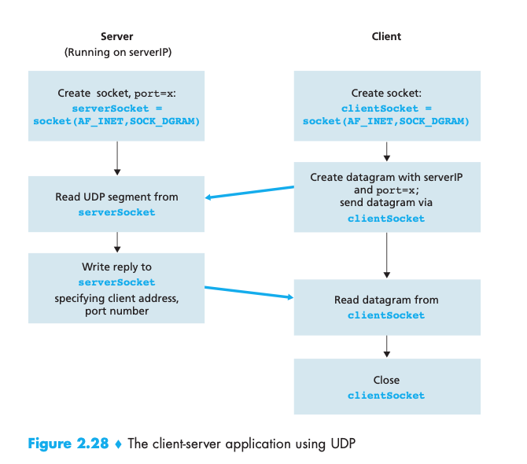
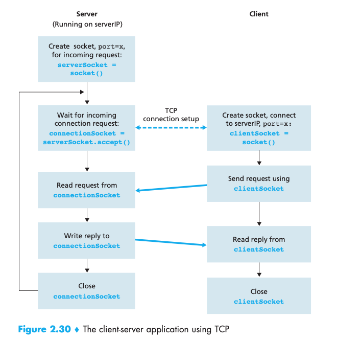
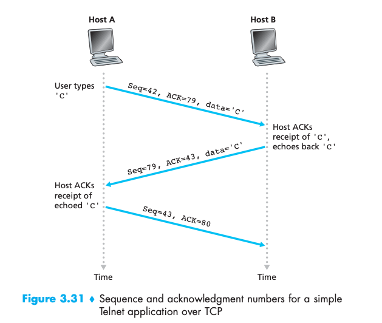
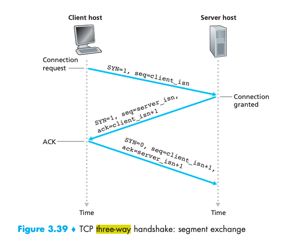
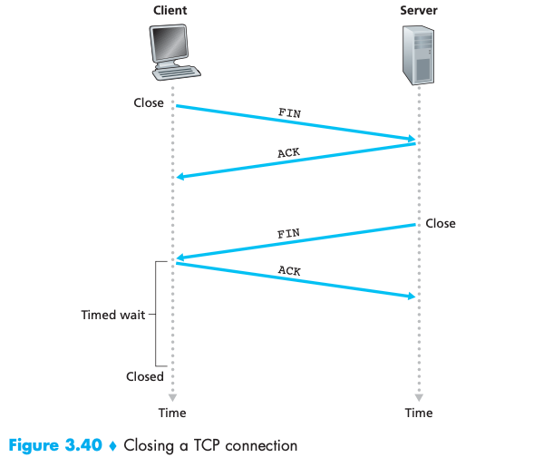
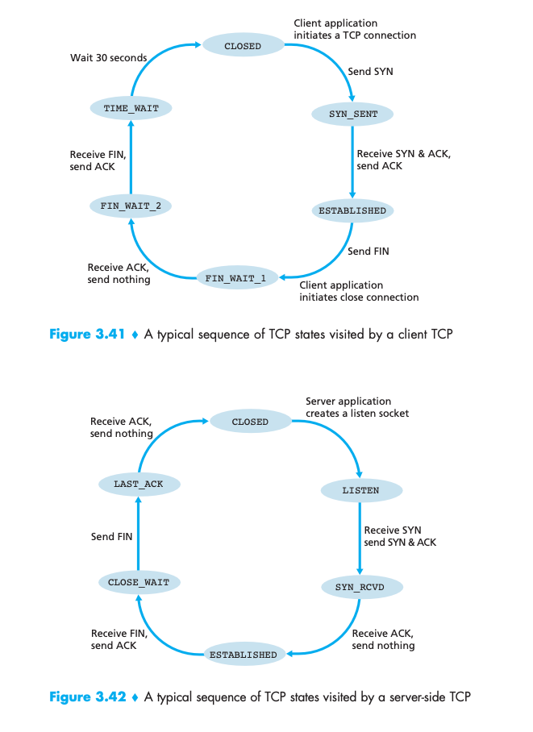

# Comparison of TCP and UDP


## Run our test

Uncomment `main_tcp()` or `main_udp()`.

````
cd code
python3 a.py
python3 b.py
python3 c.py
````


<!-- https://stackoverflow.com/questions/19742345/what-is-the-format-for-date-parameter-of-git-commit -->

## Analysis


### [Server](a.py)

In `TCP` server is doing on socket `s`

````
s.bind(('localhost', 7777))
s.listen() [a]
conn, addr = s.accept() # Manage in a threadpool to handle multiple connection [c]
conn.recv [2]
conn.sendall(b"thanks") [3]
````


whereas in `UDP` 


````
s.bind(('localhost', 7777))
data, addr = s.recvfrom(1024) [2]
s.sendto(b"thanks", addr) [3]
````

### [Client](b.py)


In TCP client is doing on socket `s`

````
s.connect(("localhost", 7777)) -- link to accept on TCP server [b] 
s.sendall(b"from B") [1]
data = s.recv(1024) [4]  
````

In UDP client is doing

````
s.sendto(b"from B", ("localhost", 7777)) [1]
data, addr = s.recvfrom(1024) [4]
````

Which is matching III-E. Récapitulatif at https://broux.developpez.com/articles/c/sockets/

Socket creation and close not shown above (RAII in Python).
Just show first send (one outisde of client loop)/receive.

Consistent with figure 2.28 and 2.30 in [computer-networking-kurose-book](#computer-networking-kurose).
<!-- check carefull OK do not re-do it. s.bind() anf s.listen() not shown in 2.30 OK YES -->

### Difference between UDP and TCP.

Note in `UDP` server has still to do the `bind`.
But `UDP` client can also do it: https://stackoverflow.com/questions/41582107/can-i-bind-a-client-socket-to-an-ip-not-belongs-to-any-interfaces

So in [b.py`main_udp`](./code/b.py) we can perform `s.bind(('localhost', 6666))` 
It will just force a specific source IP in UDP datagram.
If we do a packet capture with `sudo wireshark` on `lo1`, with `s.bind(('localhost', 6666))`  on client, we will see source IP is `6666` whereas otherwise it is randomly chosen.

Obviously `TCP` client can also do the `bind`.
So in [b.py`main_tcp`](./code/b.py) we can perform `s.bind(('localhost', 5555))
Also verified same behavior via Wireshark.
 

Note if `a (server)` is not doing the bind (UDP and TCP),  `b (client)`  can not know which port to target.
When `a` is answering to `b`: (also visibe via Wireshark)

````
Wireshark pcap

User Datagram Protocol, Src Port: 38121, Dst Port: 7777 (b->a) 
User Datagram Protocol, Src Port: 7777, Dst Port: 38121 (a->b)
````
- it uses as destination (IP, Port), the one in `b->a` UDP datagram source (IP,Port) 
- it uses as source (IP, Port), the one in `b->a`  UDP datagram destination (IP, Port) : the one we bind on server side

`b->a` source port has an importance in `Port Restricted Cone NAT`, and `symetric NAT`.

See
- http://wapiti.enic.fr/commun/ens/peda/options/ST/RIO/pub/exposes/exposesrio2005/cleret-vanwolleghem/nat.htm and [type of nat](./appendices/appendix-type-of-nat.md) and [tailscale section below](#tailscale-vpn)
- https://github.com/scoulomb/home-assistant/blob/main/appendices/VPN-tailscale.md


API is not consistent in TCP `recv` is done on `conn` object on server side, whereas done on socket in client side.
See comment on [computer-networking-kurose-book](#computer-networking-kurose).


Unlike in TCP, in context of UDP we use client/server terminology but there is not really strong concept of client/server, as there is no socket establishment direction as such.
However, what we can see as "UDP Server", HAS TO do the bind and what we see as b (server replies using  destination (ip, port) in client source packet (and we saw client can also do the bind).

To be more exact <!-- comment JM and totally well integrated -->
> C'est pas totalement vrai que le client doit envoyer le premier message.
> Si le client et le server se sont mis d'accord en avance sur le port (ou il a ete decouvert par un autre moyen), alors le server ou le client peut commencer sans soucis.
> Mais de maniere generale, c'est vrai que c'est plus courant que le client initie
In that case what we see as "client" has to do the bind and it totally removes the concept of client/server in UDP! 


**Therefore our  conclusion is that socket establishment direction is more a `TCP` concept**.


## TCP Socket establishment direction 


- TCP **Socket establishment direction** is inbound (and we are server) if on our end/entity (1A, corpo) we do
    - s.bind
    - s.listen
    - s.accept
- else TCP socket easblishment is outbound (and we are client), on our end/entity we do
   - s.connect -- link to accept on TCP server


- We can extend to UDP client/server where we consider server (when port is not communicated via other mechanism)
    - The part which HAS TO do the bind (as seen above both client/server can do it),
-  and client
    - Part sending first message 
    
## Message flow direction

- **Message flow direction is**
    - outound for entity sending the query, and receiving the reply
    - inbound for entity receiving the query, and sending the reply 

- Please note that  Message flow direction != TCP Socket establishment direction, see: /private_script/blob/main/Links-story-notes/socketEstablishmentDirection.md
And as in this example message flow direction can be bi-directionnal. (Comment: For UDP, client still has to send first message (if port is not known in advance))


- Usually message flow direction same as TCP socket establishment direction (for example we query an API). 
- Example when not in same direction is push notification: from mobile device perspective TCP socket establishment is outbound, message flow is inbound.

## Socket establishment direction, message flow direction and NAT/FW traversals

### Basic

- This same mechanism (where socket establishment is outbound and message flow inbound for home user) is heavily used by smarthome devices like Hue, Netatmo, Somfy Tahoma, Apple Home (to local HUE via HomeKit), QNAP, plex server
- Examples given in https://github.com/scoulomb/home-assistant
- Instead of having a static DNAT rule to access internal API (or VPN to API): `Client->  IP public -> DNAT -> Hue hub` as made here: https://github.com/scoulomb/myhaproxy/blob/main/README.md#we-have-seen-3-ways-to-access-internal-server-from-external 
-  What they are doing is : `Client -> HUE cloud <- Hub HUE` (arrow are socket establishment direction)

    ````
    Hub HUE do outbound socket establishment to HUE cloud (TCP socket permanent keep alive)
    If input 
            HUEcloud.socket.send(toHubHue) 
    ````
- Alternative is: connected devices (Hue, Netatmo...) can perform conitnous polling (CURL GET) to the server until ITO rather than keeping socket open. When server has data it sends the data. It means device is still opening the socket. This is what is also used by chat, they do a poll to central server to receive message.(Except ms teams where robotic user where here server is pushing (it means teams server doing inbound socket establishment to chat client)) <!-- michel -->
- So we do

    ````
    HUBHue doing curl to HUECloud
    While True:
        curl -X GET huecloud.com/events: return payload with list of actions

    ````
- In the second alternative (`/events`) note we come back in a case where socket establishment direction == nessage flow, and device at home doing outbound socket establishment

### Tailscale VPN 

- See also tailscale VPN which enables to traverse NAT without defining [static DNAT rule](#basic) (or chain of DNAT): https://github.com/scoulomb/home-assistant/blob/main/appendices/VPN-tailscale.md. 
- They are creating NAT(s) mapping / traversing NAT(s) by sending packets using the principle "packet must flow out before packet can flow back in", p5 and p8 of document).
- It includes source/destination rewrite as any NATs: https://github.com/scoulomb/docker-under-the-hood/tree/main/NAT-deep-dive-appendix#pellicular-case-for-outbound.
- (Note this page http://wapiti.enic.fr/commun/ens/peda/options/ST/RIO/pub/exposes/exposesrio2005/cleret-vanwolleghem/nat_port_restricted.htm on different type of NAT applies to SNAT). 
- In Tailscale doc they mention (https://github.com/scoulomb/home-assistant/blob/main/appendices/VPN-tailscale.md)
    - p2: local proxy (which they do not want) which is equivalent to solution described above with [HUE cloud](#basic)
    - p5: adding rules (here they talk firewall in that stage of doc but same apply to NAT) equivalent to static DNAT rules, which they do not want as does not scale in mesh network
    - p15: DERP protocol equivalent local proxy (p2) when we can not use STUN protocol for symetric NAT. See [type of NAT appendice](./appendices/appendix-type-of-nat.md)
- See link with [Network devices and socket establishment](#network-devices-and-socket-establishment) below
    

## Packet direction

- Also not for Internet provider only **packet direction** is counting in their upload speed:
    - Upload speed (debit montant): uplaod a file, download a file in a Natted server at home: https://github.com/scoulomb/home-assistant/blob/main/sound-video/setup-your-own-media-server-and-music-player/README.md 
    - Downlaod speed (debit descendant): dowanload a file on internet, what a netflix move
- ADSL optimizes the download speed thus asymetric and slow Jellyin donwload speed (from mobile client perspective, where socket establishment + message direction is inbound but big packt in reply are outbound)

<!-- here -- all above is OK -->


## Network devices and socket establishment


In term of network setup usually
- Outbound socket establishment entity usually exposes a SNAT facade (IP, Port) through SNAT policy on Firewall/Loadbalancer, and filter the traffic via filtering rules on firewall
    - At home we expose our WAN IP (CGNAT IP in most complex case)
- Inbound socket establishment entity has Filtering rules on firewall accepting traffic from SNAT facade (IP) to destination (IP, Port). It listens traffic on destination (IP, Port). 
    - Listen can be 
        - on Firewall (requires a routing rules for router to FW, back to router then router to LB)
        - or LoadBalancer (requires a DNAT from fw to LB)
    - At home when receiving a message only NAT to traverse no firewall,

See link with private_script
<!--
- See link with 
    - private_script/blob/main/Links-mig-auto-cloud/listing-use-cases/listing-use-cases.md#ip-used-in-outbound-only-socket-establishment-case-where-legacy-datacenter-f5-wasis-involved
    - private_script/blob/main/Links-mig-auto-cloud/migration-snat-dnat.md#migration-and-snatdnat (Design v1/v2)
-->

When a packet is going out firewall accepts the response of packet coming back, see https://github.com/scoulomb/home-assistant/blob/main/appendices/VPN-tailscale.md 


And this is used by:  https://github.com/scoulomb/home-assistant/blob/main/appendices/VPN-tailscale.md 


## VPN IP as SNAT facade

See VPN usage here: https://github.com/scoulomb/home-assistant/blob/main/appendices/VPN.md#into. So here we are talking about interesting in Facade.

- In corpo network, when no VPN is put in place between employee laptop and corporate network (vpn used connect to remote local network) for example a git server), we need to open firewall to have source IP of the employee allowed (inbound establishment to corpo). It can be the NAT IP of the box. VPN with static IP adress can help to always go out with same IP (VPN used for SNAT). Practical if client moving or using 4g device

See https://github.com/scoulomb/home-assistant/blob/main/appendices/VPN.md#into (remote local nw and snat : Client -> VPN TUNNEL -> LAN -> SNAT ) 

<!-- Referenced in /private_script/blob/main/Links-mig-auto-cloud/Additional-comments.md#socket-establishment-directrion-vs-message-flow-direction -->

- We could also use similar principle to to not have your public IP banned: https://github.com/scoulomb/home-assistant/blob/main/sound-video/setup-your-own-media-server-and-music-player/README.md#acquire-music as we could do via proton VPN

- We can use QNAP VPN to allow al client to always go out via same IP
- Tailscale allow this via exit nodes: https://tailscale.com/kb/1103/exit-nodes (otherwise overlay network which does not impact public internet traffic)
- QNAP and tailscale described in https://github.com/scoulomb/home-assistant/blob/main/appendices/VPN.md are local VPN.


## Links with HTTP over socket

https://github.com/scoulomb/http-over-socket/tree/main: where we had also implemented a HTTP client/server over TCP. 

<!--quic udp etc -- skip -->

<!-- see also link to https://github.com/scoulomb/private_script/blob/main/Links-mig-auto-cloud/Additional-comments.md#flip -->

<!-- all above ccl and tailscale OK-->


## computer-networking-kurose

### Digital

https://github.com/scoulomb/Computer-Networking-Keith-Ross-6th-edition
https://github.com/scoulomb/Computer-Networking-Keith-Ross

### Printed 

6th international edition, all reference in this doc are made in that edition

### Chapter 2.7: Socket programming: Creating network application - 182 

This is consistent with what we have in this document qne this diagram




Here [above](#difference-between-udp-and-tcp), we commented
> API is not consistent in TCP `recv` is done on `conn` object on server side, whereas done on socket in client side.


In Kurose book, they bring more clarity.
We have 2 sockets (p190)
- Welcoming socket: a socket to accept incoming connection, and perform [3 way handshake](#chapter-356-tcp-connection-management)
- Connection socket: a socket for byte exchange 

More details @: https://stackoverflow.com/questions/41389880/why-does-tcp-socket-programming-need-two-socketsone-welcome-socket-and-one-conn

> The reason is that TCP has two different kinds of state that you want to control, whereas UDP has only one.

> When listening for TCP connections on a port, the networking stack needs to keep track of the port number and interface(s) you are listening on with that socket, as well as the backlogged list of incoming TCP connection-requests for that socket, and it keeps that state in an internal data structure that is associated with the socket you pass to listen()/bind()/accept(). That data structure will be updated for as long as the socket exists, and will be discarded when you close() that socket.

> Once you have accepted a TCP connection, on the other hand, the new TCP socket returned by accept() has its own connection-specific state that needs to be tracked separately -- this state consists of the client's IP address and source port, TCP packet ID sequences, TCP window size and send rate, the incoming data that has been received for that TCP connection, outgoing data that has been sent for that TCP connection (and may need to be resent later if a packet gets dropped), etc. All of this is stored in a separate internal data structure that is associated specifically with that new socket, which will be updated until that new socket is close()'d, at which point it will be discarded.

> Note that the lifetimes of these two types of state are very much independent of each other -- for example, you might decide that you don't want to accept any more incoming TCP connections and therefore you want to close the first (connections-accepting) socket while continuing to use the second (TCP-connection-specific) socket to communicate with the already-connected client. Or you might do the opposite, and decide that you don't want to continue the conversation with that particular client, so you close the second socket, but you do want to continue accepting more TCP connections, so you leave the first socket open. If there was only a single socket present to handle everything, closing down just one context or the other would be impossible; your only option would be close() the single socket and with it lose all of the state, even the parts you actually wanted to keep. That would be awkward at best.

> UDP, on the other hand, has no notion of "accepting connections", so there is only one kind of state, and that is the set of buffered sent and/or received packets (regardless of their source and/or destination). As such, there is generally no need to have more than one UDP socket.

And looking at doc, it is consistent

````
def accept(self):
    """accept() -> (socket object, address info)

    Wait for an incoming connection.  Return a new socket
    representing the connection, and the address of the client.
    For IP sockets, the address info is a pair (hostaddr, port).
    """
````

However same port as welcoming socket is used on connection socket (we can not listen on same port but can have multiple connection socket)

Evidence

````
Frame 803: 69 bytes on wire (552 bits), 69 bytes captured (552 bits) on interface lo0, id 0
Null/Loopback
Internet Protocol Version 4, Src: 127.0.0.1, Dst: 127.0.0.1
Transmission Control Protocol, Src Port: 5555, Dst Port: 7777, Seq: 59, Ack: 31, Len: 13
Data (13 bytes)

EA@@³a»Th°ºNëþ5
'Â?
ÌÐgot something
````

(via Wireshark on mac arm)

<!-- section socket programming and all above OK YES CCCL-->
<!-- yes and recheck sequence OK -->

### Chapter 3.5.2: TCP segment structure


p 236, 6th, virtual edition

> **Sequence Numbers and Acknowledgment Numbers**
> Two of the most important fields in the TCP segment header are the sequence number field and the acknowledgment number field. 
> These fields are a critical part of TCP’s reliable data transfer service. But before discussing how these fields are used to provide reliable data transfer, 
> let us first explain what exactly TCP puts in these fields.
> TCP views data as an unstructured, but ordered, stream of bytes. 
> TCP’s use of sequence numbers reflects this view in that sequence numbers are over the stream of transmitted bytes
> and not over the series of transmitted segments. The sequence number for a segment is therefore the byte-stream number of the first byte  in the segment.

> Let’s look at an example. 

> Suppose that a process in Host A wants to send a stream of data to a process in Host B over a TCP connection. 
> The TCP in Host A will implicitly number each byte in the data stream. 
> Suppose that the data stream consists of a file consisting of 500,000 bytes, that the MSS is 1,000 bytes, 
> and that the first byte of the data stream is numbered 0. As shown in Figure 3.30, TCP constructs 500 segments out of the data stream. 

> The first segment gets assigned sequence number 0, the second segment gets assigned sequence number 1,000,
> the third segment gets assigned sequence number 2,000, and so on. 
> Each sequence number is inserted in the sequence number field in the header of the appropriate TCP segment.

> Now let’s consider acknowledgment numbers. These are a little trickier than sequence numbers. 
> **Recall that TCP is full-duplex, so that Host A may be receiving data from Host B while it sends data to Host B (as part of the same TCP connection).**
> Each of the segments that arrive from Host B has a sequence number for the data
> flowing from B to A.
> **The acknowledgment number that Host A puts in its segment is the sequence number of the next byte Host A is expecting from Host B.**

> It is good to look at a few examples to understand what is going on here.
> Suppose that Host A has received all bytes numbered 0 through 535 from B and suppose that it is about to send a segment to Host B. 
> Host A is waiting for byte 536 and all the subsequent bytes in Host B’s data stream. So Host A puts 536 in the acknowledgment number field of the segment it sends to B.

> As another example, suppose that Host A has received one segment from Host B containing bytes 0 through 535 and another segment containing bytes 900 through 1,000. For some reason Host A has not yet received bytes 536 through 899. 
> In this example, Host A is still waiting for byte 536 (and beyond) in order to re-create B’s data stream. 
> Thus, A’s next segment to B will contain 536 in the acknowledgment number field.
> Because TCP only acknowledges bytes up to the first missing byte in the stream, TCP is said to provide cumulative acknowledgments.
> This last example also brings up an important but subtle issue. Host A received the third segment (bytes 900 through 1,000) before receiving the second segment (bytes 536 through 899).
> Thus, the third segment arrived out of order. The subtle issue is: What does a host do when it receives out-of-order segments in a TCP con- nection? Interestingly, 
> the TCP RFCs do not impose any rules here and leave the decision up to the people programming a TCP implementation. There are basically two choices: either (1) the receiver immediately discards out-of-order segments (which, as we discussed earlier, can simplify receiver design), 
> or (2) the receiver keeps the out-of-order bytes and waits for the missing bytes to fill in the gaps. 
> Clearly, the latter choice is more efficient in terms of network bandwidth, and is the approach taken in practice.
> In Figure 3.30, we assumed that the initial sequence number was zero. In truth, both sides of a TCP connection randomly choose an initial sequence number. This is done to minimize the possibility that a segment that is still present in the network from an earlier, already-terminated connection between two hosts is mistaken for a valid segment in a later connection between these same two hosts (which also hap- pen to be using the same port numbers as the old connection) [Sunshine 1978].


In our example we can see this

````
15	6.536686	127.0.0.1	127.0.0.1	TCP	60	5555 → 7777 [PSH, ACK] Seq=20 Ack=7 Win=408256 Len=4 TSval=449381400 TSecr=1618444604
16	6.536735	127.0.0.1	127.0.0.1	TCP	56	7777 → 5555 [ACK] Seq=7 Ack=24 Win=408256 Len=0 TSval=1618444604 TSecr=449381400
17	7.542019	127.0.0.1	127.0.0.1	TCP	62	7777 → 5555 [PSH, ACK] Seq=7 Ack=24 Win=408256 Len=6 TSval=1618445609 TSecr=449381400
18	7.542165	127.0.0.1	127.0.0.1	TCP	56	5555 → 7777 [ACK] Seq=24 Ack=13 Win=408256 Len=0 TSval=449382405 TSecr=1618445609
19	8.547463	127.0.0.1	127.0.0.1	TCP	62	7777 → 5555 [PSH, ACK] Seq=13 Ack=24 Win=408256 Len=6 TSval=1618446615 TSecr=449382405
20	8.547468	127.0.0.1	127.0.0.1	TCP	69	5555 → 7777 [PSH, ACK] Seq=24 Ack=13 Win=408256 Len=13 TSval=449383411 TSecr=1618445609
21	8.547802	127.0.0.1	127.0.0.1	TCP	56	5555 → 7777 [ACK] Seq=37 Ack=19 Win=408256 Len=0 TSval=449383411 TSecr=1618446615
````

`7777` is server, `5555` is client.

````
15: stop
16: NO DATA
17: thanks
18 NO DATA
19: thanks
20: got something
21: NO DATA
````
Let's analyse packet 18, 19, 20, 21:

Recall sequence number is a `byte stream number.`
And i `**The acknowledgment number that Host A puts in its segment is the sequence number of the next byte Host A is expecting from Host B.**`

````
18 5555 → 7777 [ACK] Seq=24 Ack=13 Win=408256 Len=0 
19 7777 → 5555 [PSH, ACK] Seq=13 Ack=24 Win=408256 Len=6 (thanks): Server ack segment where next byte has for seq 24 (segment 18 as it has for Seq = 24 and len(data) = 0),
and then server send data client. It uses segment/pack with seq= 13
20 5555 → 7777 [PSH, ACK] Seq=24 Ack=13 Win=408256 Len=13 (got something): Client RE-ack segment where next byte has for seq 13 (segment 18), send data with Seq=24. Same sequnce number as segment/packet 18 as no data was sent 
21 5555 → 7777 [ACK] Seq=37 Ack=19 Win=408256 Len=0 : client ack segment where next byte has for seq 19 (segment 19 as it has for Seq = 13 and len(data) = 6). Seq number and segment number as same num by coincidence here
````

Also note

> > **Recall that TCP is full-duplex, so that Host A may be receiving data from Host B while it sends data to Host B (as part of the same TCP connection).**

Here we are talking about packet [direction](#packet-direction).
And packet can contain data or not, and we can send data and do ack at same time (Piggybacking). 

Figure 3.31 in book with telnet example OK and consistent above, we can generalize:



- Packet n-1: Seq=X ACK=Y, data (n-1), client -> server
- Packet n  : Seq=Y ACK=X+len(data (n-1)), data (n) , server -> client  (ACK and send data)
- Packet n+1: Seq=ACK of n = X+len(data (n-1)), ACK=Y+ len(data (n)), client -> server (ACK only)

<!-- OK CCL STOP -- analysis OK STOP - FORBIDDEN TO RECHECK OK STOP!! section and above OK YES CCL CCL -->

### Chapter 3.5.6 TCP connection management

#### TCP three-way handshake

Figure 3.39 shows 3 way handshake



It is interesting to see parallel with section [above](#chapter-352-tcp-segment-structure), that it is the same as figure 3.31 generalization where
- X=client_isn (except for first mssage)
- Y=server_isn
- All data are of size 1 (even if no data as SYN is a flag)

<!-- OK I recheck full sequence, we are aligned and fully consistent, OK STOP -->


A TCP half open connection is a connection where last ACK is not received.

It is used for SYN-FLOOD attack. A way to prevent this is to have server to not allocate resourceuntil last ACK not received.
Now we understand connection socket is different from welcoming socket used for 3 way handshake, we can understand why resource can allocated after,
See [above, chapter 2.7](#chapter-27-socket-programming-creating-network-application---182-)

Also some probing mechanism can use half open connection. 

### FIN / RST

We can close connection by sending a FIN - ACK




A peer can reset the connection 

See https://stackoverflow.com/questions/13049828/fin-vs-rst-in-tcp-connections

> - FIN says: "I finished talking to you, but I'll still listen to everything you have to say until you say that you're done."
> - RST says: "There is no conversation. I won't say anything and I won't listen to anything you say."
> - RST is useful if you have long lasting TCP connection with little traffic. If one of the computers is restarted, it forgets about the connection, and the other computer gets RST, as soon as it sends another packet.

When we RST, we even do not wait for ACK, there is no connection 

And state machine describe for client in book is similar for server



In Python example when closing a program we can see RST is sent.

REST connection can interesting when switching traffic (before, and after) to avoid client to wait for timeout and reconnect immediatly.

### BONUS on FIN/RST

- Seems even when server `exit`, packet still sent on connection socket.
- How to send a FIN/RST: https://stackoverflow.com/questions/409783/socket-shutdown-vs-socket-close 

