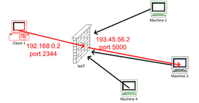
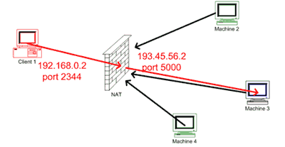
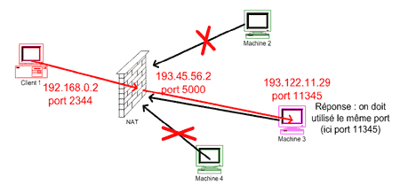

# Type of NAT

Source: http://wapiti.enic.fr/commun/ens/peda/options/ST/RIO/pub/exposes/exposesrio2005/cleret-vanwolleghem/nat.htm

Here we refer to SourceNAT (and not destination NAT)

This is link to Tailscale section in [README](../README.md#tailscale-vpn)

## 3 types of Source NAT

### Full Cone NAT

Toutes les requêtes d’un même couple « adresse port » interne sont mappés sur le même couple « adresse port » externe. On réalise ainsi des couples de correspondance entre adresse « IP et port » interne et « adresse IP et port » externe. Un problème de sécurité évident en effet tout hôte externe peut contacter une machine en interne en s’adressant au couple «adresse port» externe s'il le connaît.

### Restricted Cone NAT

Dans un Restricted Cone NAT on repart du principe du Full Cone NAT en y ajoutant une règle stipulant qu’un packet sortant est nécessaire pour ouvrir une liaison entrante. Seul le destinataire peut répondre et ce en utilisant n’importe lequel de ses ports. On réduit ainsi les problèmes de sécurités du Full Cone NAT.

### Restricted Port Cone NAT

Le principe est le même que pour le Restricted Cone NAT mais s’y ajoute ici une notion de port au niveau de la réception. C'est-à-dire que cera toujours le destinataire et lui seul qui pourra répondre mais il sera obligé de le faire avec le port sur lequel il a été contacté.

### Symetric NAT

Ici le mapping n’est pas uniquement calculé sur l’adresse IP et le port de l’émetteur comme c’était le cas pour les autres types de NAT mais il est calculé sur l'adresse et le port de l’émetteur et sur l’adresse et le port de la machine en réception.

--> So here NAT mapped IP/Port depends on destination

## Summary in Table 

As propsed in Tailscale doc we can summarize those kind of NAT in a table

## Tailscale context 

And also we can in their context that only symetric NAT (hard NAT) is complex, because they can not use STUN to get NAT IPs and exchange the packet.
This where they have to use DERP.  

Other source: https://learningnetwork.cisco.com/s/question/0D56e0000CWxJ9sCQF/lets-explain-in-details-full-cone-nat-restricted-cone-nat-and-symmetric-nat-terminologies-vs-cisco-nat-terminologies

<!-- all above ccl -->